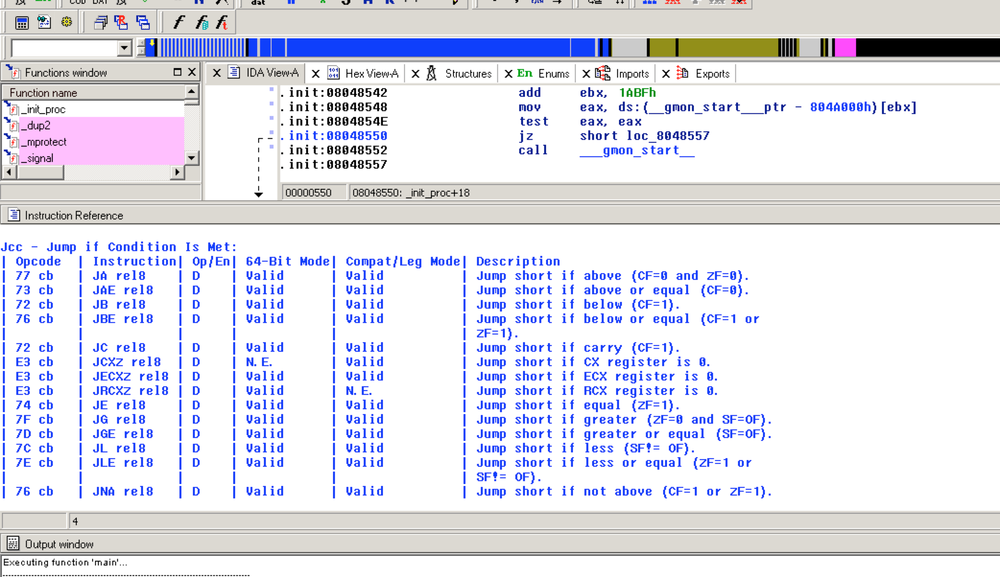
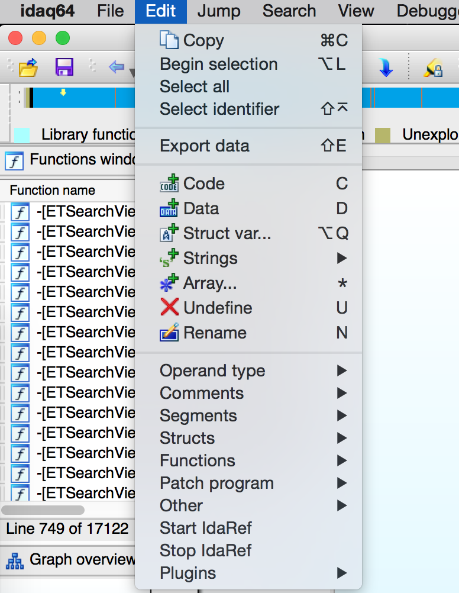
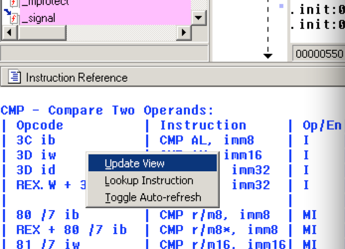

IdaRef
======
IDA Pro Full Instruction Reference Plugin - It's like auto-comments but useful.

I'm generally pretty good at figuring out what various Intel instructions do.
But, once in a while I need to either know some precise detail (i.e. exact 
side effects of SUB) or come across a rare instruction. Then I break my train
of thought and have to dig out the reference manual. Which got me thinking: 
<i>Why can't IDA just give me the full documentation?</i>

Enter IdaRef:

The plugin will monitor the location for your cursor (ScreenEA) and display the full
documentation of the instruction. At the moment it only supports x86-64 and ARM, 
however adding support for other architectures is relatively easy.

Usage
-----
Simply checkout or download the repository and install it to your IDA plugins directory:

    idaref.py -> /Applications/IDA Pro 6.8/idaq.app/Contents/MacOS/plugins/idaref.py
    arm.sql -> /Applications/IDA Pro 6.8/idaq.app/Contents/MacOS/plugins/arm.sql
    x86-64.sql -> /Applications/IDA Pro 6.8/idaq.app/Contents/MacOS/plugins/x86-64.sql

You can also use the installer.sh file but you'll need to open it and edit the IDA path 
if you're not using Mac OS and IDA 6.8.

Once loaded, the plugin can be turned ON by going to Edit/Start IdaRef menu option. To 
control the output right-click on the tab window to get a menu:

* Update View - Load documentation for currectly selected instruction.
* Lookup Instruction - Manual load documentation, you'll be prompted for the instruction.
* Toggle Auto-refresh - Turn on/off auto loading of documentation and rely on the first two options.

    
Internals
---------
Upon loading the script will look for SQlite databases in the same directory as the 
itself. The naming convention for the database files is [arch name].sql. The 
[arch name] will be presented to the user as choice.

The database has a table called 'instructions' and two columns called 'mnem' and
'description'. The instructions are looked up case insensitive (upper case) by the
mnem value. The text from description is displayed verbatim in the view.

To add support for more architectures simply create a new database with those
columns and place it in the the script directory.

    import sqlite3 as sq
    con = sq.connect("asm.sqlite")
    con.text_factory = str
    cur = con.cursor()
    cur.execute("CREATE TABLE IF NOT EXISTS instructions (platform TEXT, mnem TEXT, description TEXT)")
    con.commit()
    
When working with x86, I noticed that many instructions point to the same documentation.
So, the plugin supports single level referencing. Just place '-R:[new instruction]' into
description to redirect the loading. 'new instruction' is the target. So, when loading 
the script will detect the link and load the new target automatically.

    cur.execute("INSERT INTO instructions VALUES (?, ?, ?)", ("x86", inst, "-R:%s" % first_inst))
    
Skeletons in the closet
-----------------------
The documentation database was created using a rather hackish screen scraping
technique by the x86doc project which I forked. So, there are probably some 
strange characters or tags in the text. At least, it is a mechanical process
so I expect that the information is correct relative to the original Intel PDF.

Ports
-----
If you're a hopper user, there is a port called hopperref: https://github.com/zbuc/hopperref

Enjoy!
------
